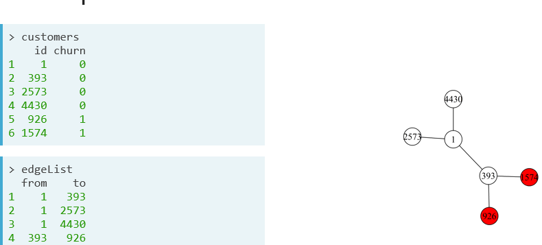

# Load dependencies:
```{r}
# Install cran packages
list.of.packages <- c("pROC","igraph")
new.packages <- list.of.packages[!(list.of.packages %in% installed.packages()[,"Package"])]
if(length(new.packages)) install.packages(new.packages)

library(pROC)
library(igraph)

```

Data Camp: Network Analysis

Predictive Analytics using Networked Data in R

Customer churning – ‘defection’

# Read in data and create igraph object
```{r}
load("../Input/StudentCustomers.RData")
load("../Input/StudentEdgelist.RData")
load("../Input/StudentNetwork.RData")
# Inspect edgeList
head(edgeList)

# Construct the igraph object
network <- graph_from_data_frame(edgeList, directed = FALSE)

# View your igraph object
network
```      

# Labeled networks and network learning:

Churn prediction in social networks:



The relational neighbor classifer:

Linked nodes have a propensity to  have a similar classifier


```{r}
# Inspect the customers dataframe
head(customers)

# Count the number of churners and non-churners
table(customers$churn)

# Add a node attribute called churn
V(network)$churn <- customers$churn

# Visualize the network
plot(network, vertex.label = NA, edge.label = NA, edge.color = 'black', vertex.size = 2)

```

# Add color:
```{r}
# Add a node attribute called color
V(network)$color <- V(network)$churn

# Change the color of churners to red and non-churners to white
V(network)$color <- gsub("1", "red", V(network)$color) 
V(network)$color <- gsub("0", "white", V(network)$color)

# Plot the network
plot(network, vertex.label = NA, edge.label = NA, edge.color = "black", vertex.size = 2)
```

# visualizing churners only
```{r}
# Create a subgraph with only churners
churnerNetwork <- induced_subgraph(network, v = V(network)[which(V(network)$churn == 1)])
                    
# Plot the churner network 
plot(churnerNetwork, vertex.label = NA, vertex.size = 2)
```

# Relational Neighbor Classifier:
```{r}
# Compute the churn probabilities
# Where is ChurnNeighbors and NonChurnNeighbors?

churn <- function(N) {
  int.max        <- 2
  int.min        <- 0
  return(as.integer(runif(N, int.min, int.max)))
}

NonChurn <- function(N) {
  int.max        <- 10
  int.min        <- 1
  return(as.integer(runif(N, int.min, int.max)))
}

ChurnNeighbors<- churn(956)
NonChurnNeighbors <- NonChurn(956)
churnProb <- ChurnNeighbors / (ChurnNeighbors + NonChurnNeighbors)

# Find who is most likely to churn
mostLikelyChurners <- which(churnProb == max(churnProb))

# Extract the IDs of the most likely churners
customers$id[mostLikelyChurners]
```


# Unsupervised learning:

Splitting the data into Training (60-80%) vs. test (40-20%) sets

The observations in teh dataset are not independent and identically distributed (id)

Probabilistic relational neighbor classifier (instead of each node being assigned to a classifier, a probability is assigned to the node)

Collective inferencing is a procedure to simultaneously label nodes in interconnected data to reduce classification error.

```{r}
# Load the pROC package and data
library(pROC)

churnProb[44]

AdjacencyMatrix <- as_adjacency_matrix(network)


# Update the churn probabilties and the non-churn probabilities
churnProb_updated <- as.vector((AdjacencyMatrix %*% churnProb) / neighbors)

# Find updated churn probability of the 44th customer
churnProb_updated[44]


# Compute the AUC
auc(customers$churn, as.vector(churnProb))

# Write a for loop to update the probabilities
for(i in 1:10){
 churnProb <- as.vector((AdjacencyMatrix %*% churnProb) / neighbors)
}

# Compute the AUC again
auc(customers$churn, as.vector(churnProb))
```

