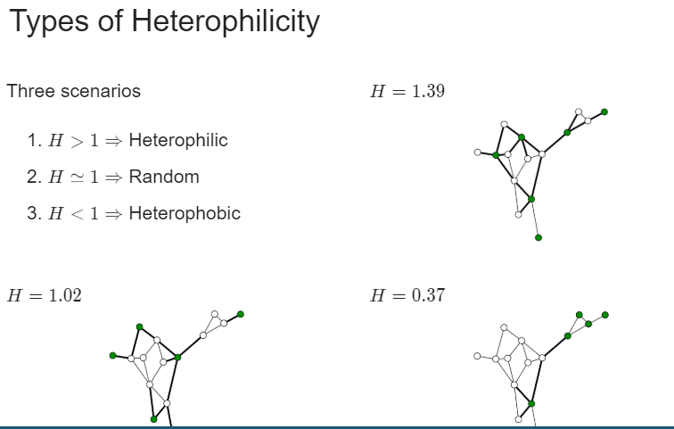

## Load dependencies:
```{r}
# Install cran packages
list.of.packages <- c("pROC")
new.packages <- list.of.packages[!(list.of.packages %in% installed.packages()[,"Package"])]
if(length(new.packages)) install.packages(new.packages)

```

Data Camp: Network Analysis

## Homophily:

Homophily: people have a strong tendency to associate with people who are more similar to themselves

Depends on: connectedness between nodes with same label

A homophilic network - when nodes with similar qualities tend to be connected

Types of edges - denote the types of relationships between the nodes that are connected by the edge

You can count the edge types


Network Connectance:
p=2*edges/nodes(nodes-1)

Number of edges in a fully connected network:
nodes(nodes-1)/2

### Extracting types of edges
```{r}
# Add the column edgeList$FromLabel
edgeList$FromLabel <- customers[match(edgeList$from, customers$id), 2]
 
# Add the column edgeList$ToLabel
edgeList$ToLabel <- customers[match(edgeList$to, customers$id), 2]
 
# Add the column edgeList$edgeType
edgeList$edgeType <- edgeList$FromLabel + edgeList$ToLabel
 
# Count the number of each type of edge
table(edgeList$edgeType)
```
In the edgeList$edgeType column, there are three different values:

0 for edges that connect two non-churn nodes.
1 for edges that connect a non-churn and a churn node. These are called mixed or cross-label edges.
2 for edges that connect two churn nodes.

### Counting types of edges
```{r}
# Count churn edges
ChurnEdges <- sum(edgeList$edgeType == 2)
 
# Count non-churn edges
NonChurnEdges <- sum(edgeList$edgeType == 0)
 
# Count mixed edges
MixedEdges <- sum(edgeList$edgeType == 1)
 
# Count all edges
edges <- ChurnEdges + NonChurnEdges + MixedEdges

#Print the number of edges
edges
```
### Counting nodes and computing connectance:
```{r}
# Count the number of churn nodes
ChurnNodes <- sum(customers$churn == 1)
 
# Count the number of non-churn nodes
NonChurnNodes <- sum(customers$churn == 0)
 
# Count the total number of nodes
nodes <- ChurnNodes + NonChurnNodes
 
# Compute the network connectance
connectance <- 2 * edges / (nodes * (nodes - 1))

# Print the value
connectance
```

A connectance of 0.001 is quite low (i.e. sparse)


## Measuring Relational Dependency: Dyadicity:

Dyadicity measures the connectedness between nodes with the same labels compared to what is expected in a random configuration of the network.


D = number of same label edges/ expected number of same label edges

D > 1 -> dyadic
D = 1 -> random
D < 1 -> anti-dyadic


## Dyadicity of  and nonchurners
In this exercise, you will compute the dyadicity amongst the churners in the network to see if they share more or fewer edges than expected in a random configuration of the network.

The variables ChurnNodes, ChurnEdges, and connectance are available for you to use.

For expected dyadicity, use the formula nC⋅(nC−1)2⋅p, where nC is the number of churners, N is the number of nodes, and p is the connectance. Dyadicity of the churners is the ratio between the actual churners and the expected churn dyadicity.
```{r}
# Compute the expected dyadicity of churners and assign it to the variable ExpectedDyadChurn.
ExpectedDyadChurn<-(ChurnNodes*ChurnNodes-1)/2 * connectance

# Compute the dyadicity of the churners by dividing ChurnEdges with ExpectedDyadChurn. Call this value DyadChurn.
DyadChurn<-ChurnEdges/ExpectedDyadChurn

DyadChurn
```
A dyadicity of 2.14 indicates there is dyadicity among churners

#### Same for non churners:
```{r}
# Compute the expected dyadicity of churners and assign it to the variable ExpectedDyadChurn.
ExpectedDyadNonChurn<-(NonChurnNodes*NonChurnNodes-1)/2 * connectance

# Compute the dyadicity of the churners by dividing ChurnEdges with ExpectedDyadChurn. Call this value DyadChurn.
DyadNonChurn<-NonChurnEdges/ExpectedDyadNonChurn

DyadNonChurn
```
A dyadicity of 0.99 indicates there is not dyadicity among Non churners


## Heterophilicity:
Measures the connectedness of nodes with opposite labels (i.e. 'cross-label edges') compared to what is expected for a random configuration of the network

Expected number of cross label edges = nw*ng*p

H = # of cross label edges/ expected # of cross label edges


H > 1 -> heterophilic
H = 1 -> random
H < 1 -> heterophobic


### Compute heterophilicity:
Similar to dyadicity, heterophilicity is the ratio between the actual number of mixed label edges and the expected number of mixed label edges. In this exercise, you will compute the network's heterophilicity.

For the expected number of mixed edges, use the formula nNC⋅nC⋅p where nNC is the number of non-churners, nC is the number of churners and p is the connectance.

You can use the variables NonChurnNodes, ChurnNodes, connectance, and MixedEdges.

```{r}
# Compute the expected number of mixed edges and assign it to the variable ExpectedHet.
ExpectedHet <- NonChurnNodes * ChurnNodes * connectance

# Compute the heterophilicity by dividing the actual number of mixed edges with the expected number of mixed edges. Call this variable Het.
Het <- MixedEdges/ExpectedHet

# Is the network heterophilic? Inspect Het to find out.
Het
```


## Summary of Homophily:
