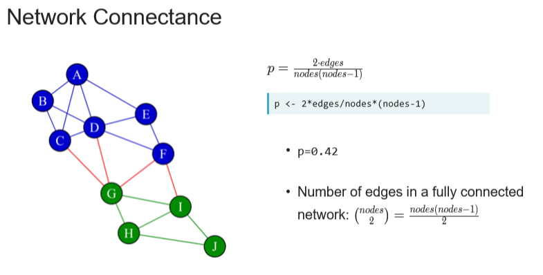
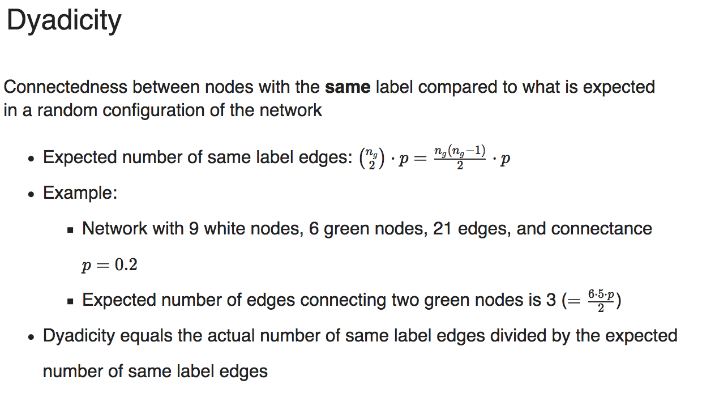
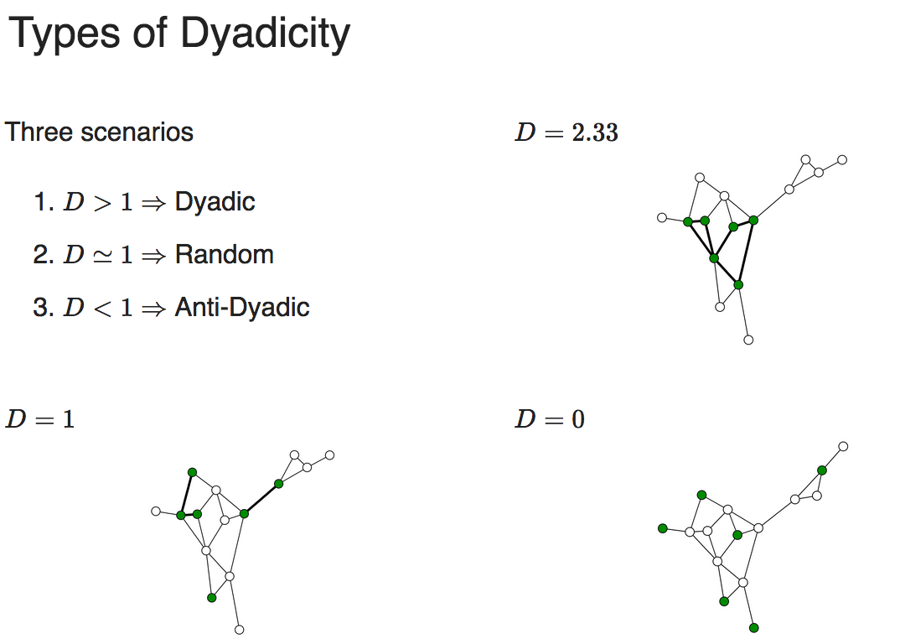

# Load dependencies:
```{r}
# Install cran packages
list.of.packages <- c("pROC")
new.packages <- list.of.packages[!(list.of.packages %in% installed.packages()[,"Package"])]
if(length(new.packages)) install.packages(new.packages)

```

Data Camp: Network Analysis

# Homophily:

Homophily: people have a strong tendency to associate with people who are more similar to themselves

Depends on: connectedness between nodes with same label

A homophilic network - when nodes with similar qualities tend to be connected

Types of edges - denote the types of relationships between the nodes that are connected by the edge

You can count the edge types



# Extracting types of edges
```{r}
# Add the column edgeList$FromLabel
edgeList$FromLabel <- customers[match(edgeList$from, customers$id), 2]
 
# Add the column edgeList$ToLabel
edgeList$ToLabel <- customers[match(edgeList$to, customers$id), 2]
 
# Add the column edgeList$edgeType
edgeList$edgeType <- edgeList$FromLabel + edgeList$ToLabel
 
# Count the number of each type of edge
table(edgeList$edgeType)

```

```{r}
# Count churn edges
ChurnEdges <- sum(edgeList$edgeType == 2)
 
# Count non-churn edges
NonChurnEdges <- sum(edgeList$edgeType == 0)
 
# Count mixed edges
MixedEdges <- sum(edgeList$edgeType == 1)
 
# Count all edges
edges <- ChurnEdges + NonChurnEdges + MixedEdges

#Print the number of edges
edges
```


# Counting nodes and computing connectance:
```{r}
# Count the number of churn nodes
ChurnNodes <- sum(customers$churn == 1)
 
# Count the number of non-churn nodes
NonChurnNodes <- sum(customers$churn == 0)
 
# Count the total number of nodes
nodes <- ChurnNodes + NonChurnNodes
 
# Compute the network connectance
connectance <- 2 * edges / (nodes * (nodes - 1))

# Print the value
connectance
```


# Measuring Relational Dependency: Dyadicity:

Dyadicity measures the connectedness between nodes with the same labels compared to what is expected in a random configuration of the network.



D = number of same label edges/ expected number of same label edges

D > 1 -> dyadic
D = 1 -> random
D < 1 -> anti-dyadic




