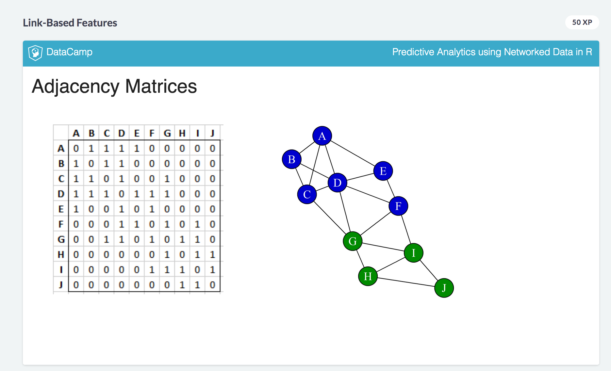
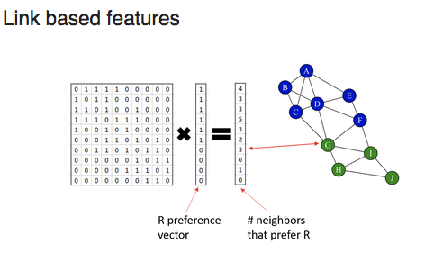

# Load dependencies:
```{r}
# Install cran packages
list.of.packages <- c("igraph","reticulate")
new.packages <- list.of.packages[!(list.of.packages %in% installed.packages()[,"Package"])]
if(length(new.packages)) install.packages(new.packages)

library(pROC)
library(reticulate)
use_condaenv(condaenv="python3.7")
```

# Network Featurization

## Basic Network Features

## Neighborhood features

### First order degree
Number of connected nodes

```{r}
degree(network)
```
A B C D E F G H I J 
4 3 4 6 3 4 5 3 4 2 

### Second order degree
Number of connected nodes that are two or less edges away

```{r}
neighborhood.size(network, order = 2)
```
[1]  7  7  9  9  8 10 10  7  8  5

### Triangles:
```{r}
count_triangles(network)
```
## Centrality Features
Betweenness - how much information tends to travel through a given node
Closeness: 

```{r}
betweenness(network)
```

```{r}
closeness(network)
```
```{r}
transitivity(network,type = 'local')


 transitivity(network,type = 'local')
```

##  Exercises:
### Extract network degree
```{r}
V(g1)$degree <- degree(g1, normalized=TRUE)

# Extract 2.order network degree
degree2 <- neighborhood.size(g1, 2)

# Normalize 2.order network degree
V(g1)$degree2 <- degree2 / (length(V(g1)) - 1)

# Extract number of triangles
V(g1)$triangles <- count_triangles(g1)

V(g1)$betweenness <- betweenness(g1, normalized=TRUE)

# Extract the closeness
V(g1)$closeness <- closeness(g1, normalized=TRUE)

# Extract the eigenvector centrality
V(g1)$eigenCentrality <- eigen_centrality(g1, scale = TRUE)$vector

# Extract the local transitivity
V(g1)$transitivity <- transitivity(g1, type='local', isolates='zero')

# Compute the network's transitivity
transitivity(g1)
```

# Link-based features:

## Adjacency matrices:



## extracting adjacency matrix in igraph
```{r}
A <- get.adjacency(g1)
```


With an adjacency matrix and the known node charcteristics (ie as a vector that matches the row/column order) you can calculate the # of neighbors that satisfy a particular characteristic.

preference <- c(1,1,1,1,1,1,0,0,0,0)
rNeighbors <- A %*% preference
as.vector(rNeighbors)
[1] 4 3 3 5 3 2 3 0 1 0

### Say you had some extra characteristics for your nodes (e.g. age)
age <- c(23,65,33,36,28,45,41,24,38,39)
degree <- degree(g)
averageAge <- A %*% age / degree


## Exercises:
```{r}
# Extract the adjacency matrix
AdjacencyMatrix <- as_adjacency_matrix(network)

# Compute the second order matrix
SecondOrderMatrix_adj <- AdjacencyMatrix %*% AdjacencyMatrix

# Adjust the second order matrix
SecondOrderMatrix <- ((SecondOrderMatrix_adj) > 0) + 0
diag(SecondOrderMatrix) <- 0

# Inspect the second order matrix
SecondOrderMatrix[1:10, 1:10]

# Compute the number of churn neighbors
V(network)$ChurnNeighbors <- as.vector(AdjacencyMatrix %*% V(network)$churn)

# Compute the number of non-churn neighbors
V(network)$NonChurnNeighbors <- as.vector(AdjacencyMatrix %*% (1 - V(network)$churn))

# Compute the relational neighbor probability
V(network)$RelationalNeighbor <- as.vector(V(network)$ChurnNeighbors / 
    (V(network)$ChurnNeighbors + V(network)$NonChurnNeighbors))
```

## Second order link-based features
```{r}
# Compute the number of churners in the second order neighborhood
V(network)$ChurnNeighbors2 <- as.vector(SecondOrderMatrix %*% V(network)$churn)

# Compute the number of non-churners in the second order neighborhood
V(network)$NonChurnNeighbors2 <- as.vector(SecondOrderMatrix %*% (1 - V(network)$churn))

# Compute the relational neighbor probability in the second order neighborhood
V(network)$RelationalNeighbor2 <- as.vector(V(network)$ChurnNeighbors2 / 
    (V(network)$ChurnNeighbors2 + V(network)$NonChurnNeighbors2))
```

## Neighborhood link-based features
Sometimes, the feature values of neighboring nodes have an effect on behavior. In this exercise, you will look at the attribute value of neighboring nodes and compute their average. You will do this for degree, triangles, transitivity, and betweenness.

You need to:

Multiply the adjacency matrix with the network attribute you want to find the average of, to obtain the overall value in the neighborhood.
To get the average, divide by the node's degree, given by the vector degree which has been pre-loaded (don't have!)
Finally, convert the result to a vector and assign to network as a node attribute.

```{r}
# Extract the average degree of neighboring nodes
V(network)$averageDegree <- 
    as.vector(AdjacencyMatrix %*% V(network)$degree) / degree

# Extract the average number of triangles of neighboring nodes
V(network)$averageTriangles <- 
    as.vector(AdjacencyMatrix %*% V(network)$triangles) / degree

# Extract the average transitivity of neighboring nodes    
V(network)$averageTransitivity<-
    as.vector(AdjacencyMatrix %*% V(network)$transitivity) / degree

# Extract the average betweenness of neighboring nodes    
V(network)$averageBetweenness <- 
    as.vector(AdjacencyMatrix %*% V(network)$betweenness) / degree
```

# Page Rank: